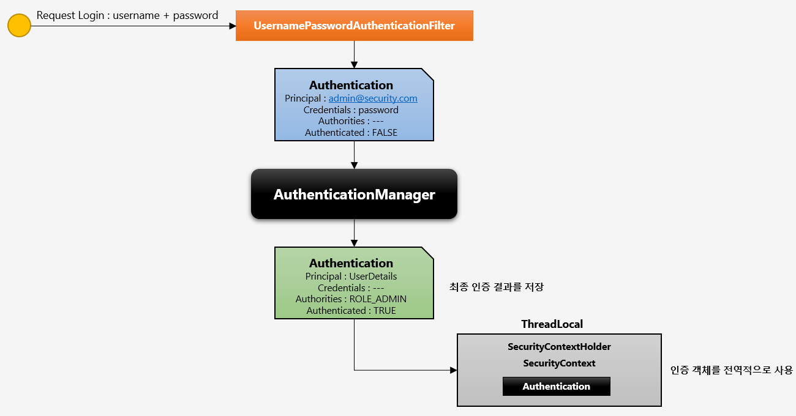
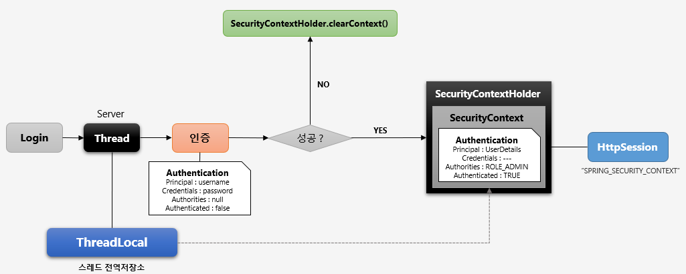
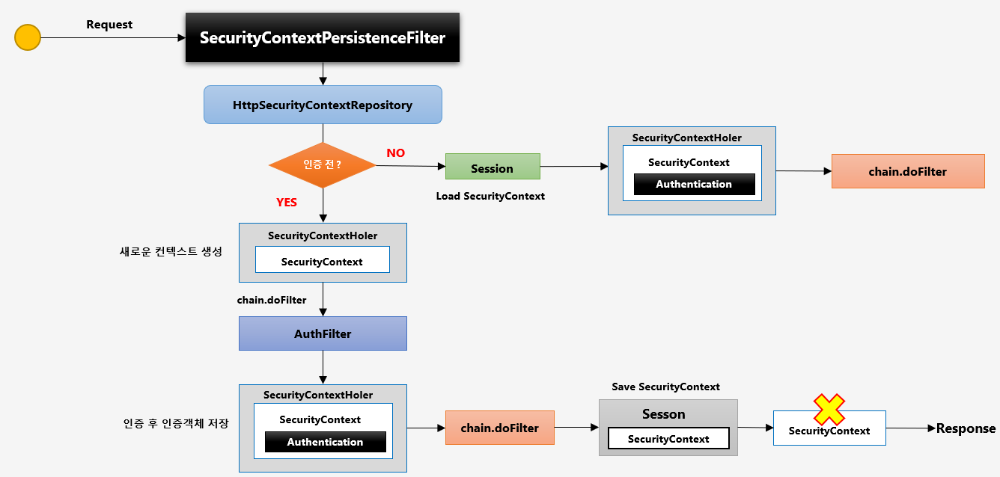
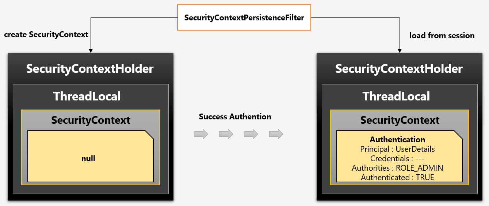
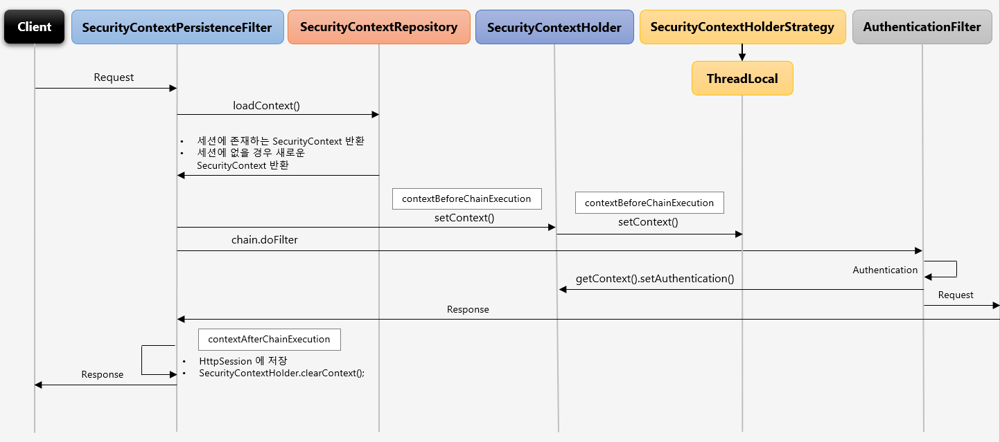
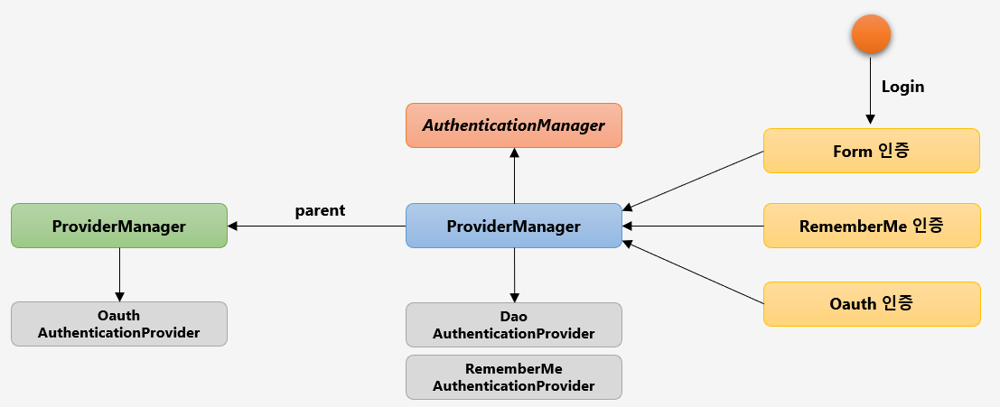
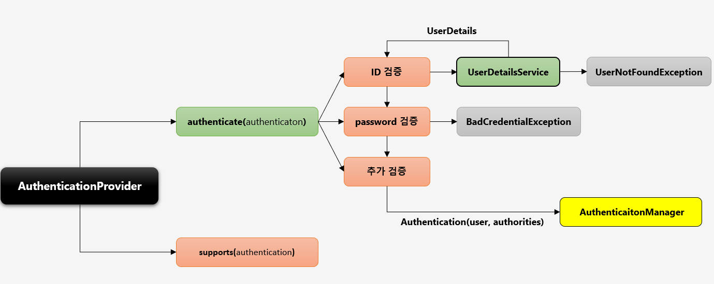
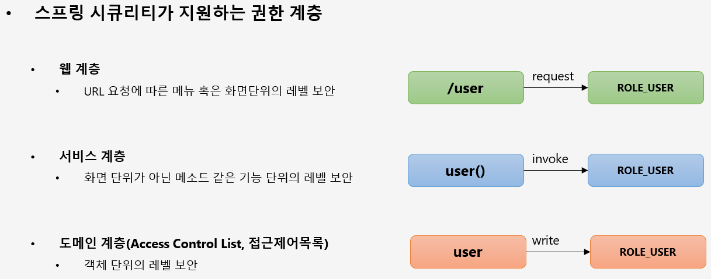
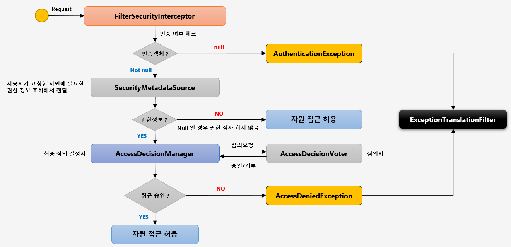
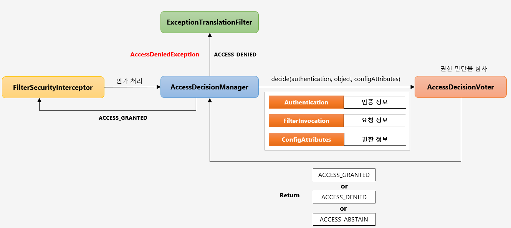

# 스프링 시큐리티 주요 아키텍처 이해

## DelegatingFilterProxy

- 서블릿 필터는 스프링에서 정의된 빈을 주입해서 사용할 수 없음
- 특정한 이름을 가진 스프링 빈을 찾아 그 빈에게 요청을 위임
    - springSecurityFilterChain 이름으로 생성된 빈을 ApplicationContext 에서 찾아 요청을 위임
    - 실제 보안처리를 하지 않음

## FilterChainProxy

- springSecurityFilterChain 의 이름으로 생성되는 필터 빈
- DelegatingFilterProxy 으로 부터 요청을 위임 받고 실제 보안 처리
- 스프링 시큐리티 초기화 시 생성되는 필터들을 관리하고 제어
    - 스프링 시큐리티가 기본적으로 생성하는 필터
    - 설정 클래스에서 API 추가 시 생성되는 필터
- 사용자의 요청을 필터 순서대로 호출하여 전달
- 사용자 정의 필터를 생성해서 기존의 필터 전,후로 추가 가능
    - 필터의 순서를 잘 정의
- 마지막 필터까지 인증 및 인가 예외가 발생하지 않으면 보안 통과

## 필터 초기화와 다중 설정 클래스

~~~
  protected void configure(HttpSecurity http) throws Exception {
    http
        .antMatcher("/admin/**")
        .authorizeRequests()
        .anyRequest().authenticated()
        .and()
        .httpBasic();
  }
}

@Configuration
class SecurityConfig2 extends WebSecurityConfigurerAdapter {

  protected void configure(HttpSecurity http) throws Exception {
    http
        .authorizeRequests()
        .anyRequest().permitAll()
        .and()
        .formLogin();
  }
~~~

- 설정 클래스 별로 보안 기능이 각각 작동
- 설정 클래스 별로 RequestMatcher 설정
    - http.antMatcher("/admin")

- 설정 클래스 별로 필터가 생성
- FilterChainProxy 가 각 필터를 가지고 있음
- 요청에 따라 RequestMatch 와 매칭되는 필터가 작동하도록 함

## Authentication

> 당신이 누구인지 증명하는 것

- 사용자의 인증 정보를 저장하는 토큰 개념
- 인증 시 아이디와 패스워드를 담고 인증 검증을 위해 전달되어 사용된다
- 인증 후 최종 인증 결과 (User 객체, 권한정보)를 담고 SecurityContext에 저장되어 전역적으로 참조가 가능하다
    - Authentication authentication = SecurityContextHolder.getContext().getAuthentication()

- 구조
    - principal : 사용자 아이디 혹은 User 객체를 저장
    - credentials : 사용자 비밀번호
    - authorities : 인증된 사용자의 권한 목록
    - details : 인증 부가 정보
    - Authenticated : 인증 여부

## SecurityContext

- Authentication 객체가 저장되는 보관소로 필요 시 언제든지 Authentication 객체를 꺼내어 쓸 수 있도록 제공되는 클래스
- ThreadLocal에 저장되어 아무 곳에서나 참조가 가능하도록 설계함
- 인증이 완료되면 HttpSession 에 저장되어 어플리케이션 전반에 걸쳐 전역적인 참조가 가능하다

## SecurityContextHolder

- SecurityContext 객체 저장 방식
    - MODE_THREADLOCAL : 스레드당 SecurityContext 객체를 할당, 기본값
    - MODE_INHERITABLETHREADLOCAL : 메인 스레드와 자식 스레드에 관하여 동일한 SecurityContext 를 유지
    - MODE_GLOBAL : 응용 프로그램에서 단 하나의 SecurityContext 를 저장한다.
- SecurityContextHolder.clearContext() : SecurityContext 기존 정보 초기화
- Authentication authentication = SecurityContextHolder.getContext().getAuthentication()

## SecurityContextPersistenceFilter

### SecurityContext 객체의 생성, 저장, 조회

- 익명 사용자
    - 새로운 SecurityContext 객체를 생성하여 SecurityContextHolder 에 저장
    - AnonymousAuthenticationFilter 에서 AnonymousAuthentication 객체를 SecurityContext 에 저장

- 인증 시
    - 새로운 SecurityContext 객체를 생성하여 SecurityContextHolder 에 저장
    - UsernamePasswordAuthenticationFilter 에서 인증 성공 후 SecurityContext 에
      UsernamePasswordAuthentication 객체를 SecurityContext 에 저장
    - 인증이 최종 완료되면 Session 에 SecurityContext 를 저장

- 인증 후
    - Session 에서 SecurityContext 꺼내어 SecurityContextHolder 에서 저장
    - SecurityContext 안에 Authentication 객체가 존재하면 계속 인증을 유지한다

- 최종 응답 시 공통
    - SecurityContextHolder.clearContext()

## Authentication Flow

## AuthenticationManager

- AuthenticationProvider 목록 중에서 인증 처리 요건에 맞는 AuthenticationProvider 를 찾아 인증처리를 위임한다
- ProviderManager 를 설정하여 AuthenticationProvider 를 계속 탐색 할 수 있다.

## AuthenticationProvider

## Authorization

> 당신에게 무엇이 허가 되었는지 증명하는 것

- 마지막에 위치한 필터로써 인증된 사용자에 대하여 특정 요청의 승인/거부 여부를 최종적으로 결정
- 인증 객체 없이 보호자원에 접근을 시도할 경우 AuthenticationException 을 발생
- 인증 후 자원에 접근 가능한 권한이 존재하지 않을 경우 AccessDeniedException 을 발생
- 권한 제어 방식 중 HTTP 자원의 보안을 처리하는 필터
- 권한 처리를 AccessDecisionManager 에게 맡김

## FilterSecurityInterceptor.png

## AccessDecisionManager, AccessDecisionVoter

### AccessDecisionManager

- 인증 정보, 요청 정보, 권한 정보를 이용해서 사용자의 자원접근을 허용할 것인지 거부할 것인지를 최종 결정하는 주체
- 여러 개의 Voter 들을 가질 수 있으며 Voter 들로부터 접근허용,거부,보류에 해당하는 각각의 값을 리턴 받고 판단 및 결정
- 최종 접근 거부 시 예외 발생

- 접근 결정의 세가지 유형
    - AffirmativeBased
        - 여러개의 Voter 클래스 중 하나라도 접근 허가로 결론을 내면 접근 허가로 판단한다
    - ConsensusBased
        - 다수표(승인 및 거부)에 의해 최종 결정을 판단한다
        - 동수일 경우 기본 접근은 허가이나 allowIfEqualGrantedDeniedDecisions 을 false 로 설정할 경우 접근 거부로 결정된다
    - UnanimousBased
        - 모든 Voter 가 만장일치로 접근을 숭인해야 하며 그렇지 않은 경우 접근을 거부한다

### AccessDecisionVoter

> 판단을 심사하는 것(위원)

- Voter 가 권한 부여 과정에서 판단하는 자료
    - Authentication :  인증 정보(user)
    - FilterInvocation : 요청 정보 (antMatcher("/user"))
    - ConfigAttributes : 권한 정보 (hasRole("USER"))

- 결정 방식
    - ACCESS_GRANTED : 접근허용(1)
    - ACCESS_DENIED : 접근 거부(0)
    - ACCESS_ABSTAIN : 접근 보류(-1)
      -Voter 가 해당 타입의 요청에 대해 결정을 내릴 수 없는 경우

