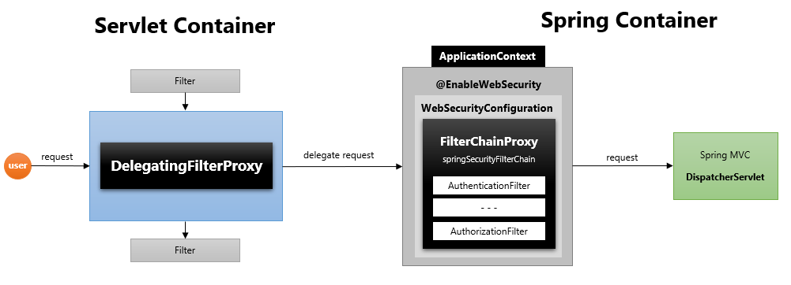
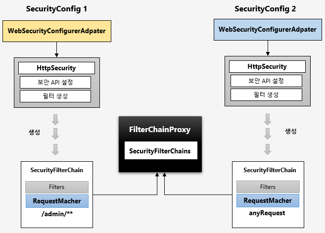
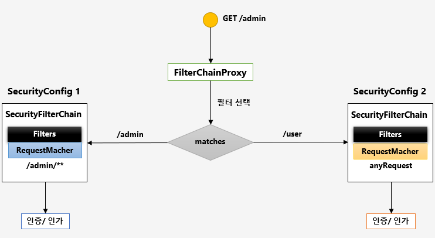

#스프링 시큐리티 주요 아키텍처 이해
## DelegatingFilterProxy

- 서블릿 필터는 스프링에서 정의된 빈을 주입해서 사용할 수 없음
- 특정한 이름을 가진 스프링 빈을 찾아 그 빈에게 요청을 위임
    - springSecurityFilterChain 이름으로 생성된 빈을 ApplicationContext 에서 찾아 요청을 위임
    - 실제 보안처리를 하지 않음
    
## FilterChainProxy
- springSecurityFilterChain의 이름으로 생성되는 필터 빈
- DelegatingFilterProxy으로 부터 요청을 위임 받고 실제 보안 처리
- 스프링 시큐리티 초기화 시 생성되는 필터들을 관리하고 제어
    - 스프링 시큐리티가 기본적으로 생성하는 필터
    - 설정 클래스에서 API 추가 시 생성되는 필터
- 사용자의 요청을 필터 순서대로 호출하여 전달
- 사용자 정의 필터를 생성해서 기존의 필터 전,후로 추가 가능
    - 필터의 순서를 잘 정의
- 마지막 필터까지 인증 및 인가 예외가 발생하지 않으면 보안 통과

## 필터 초기화와 다중 설정 클래스

~~~
  protected void configure(HttpSecurity http) throws Exception {
    http
        .antMatcher("/admin/**")
        .authorizeRequests()
        .anyRequest().authenticated()
        .and()
        .httpBasic();
  }
}

@Configuration
class SecurityConfig2 extends WebSecurityConfigurerAdapter {

  protected void configure(HttpSecurity http) throws Exception {
    http
        .authorizeRequests()
        .anyRequest().permitAll()
        .and()
        .formLogin();
  }
~~~
- 설정 클래스 별로 보안 기능이 각각 작동
- 설정 클래스 별로 RequestMatcher 설정
    - http.antMatcher("/admin")
    
- 설정 클래스 별로 필터가 생성
- FilterChainProxy가 각 필터를 가지고 있음
- 요청에 따라 RequestMatch와 매칭되는 필터가 작동하도록 함
