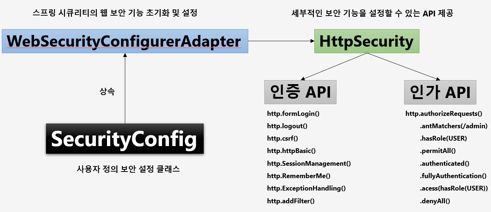
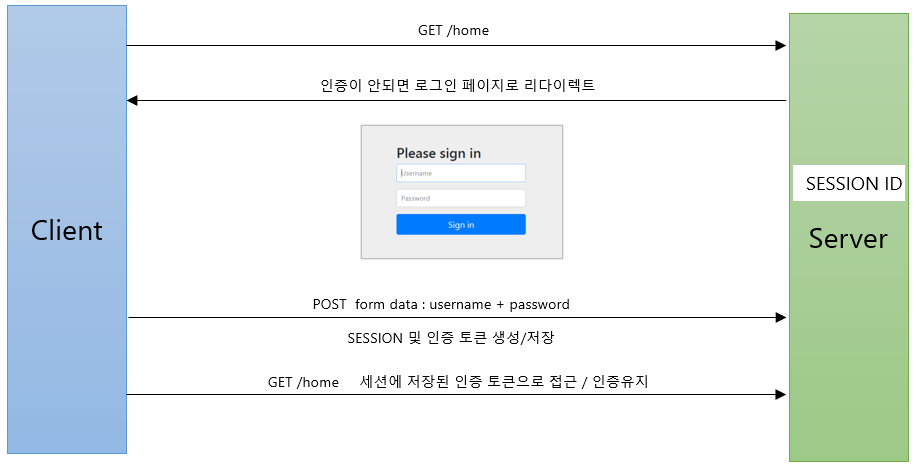
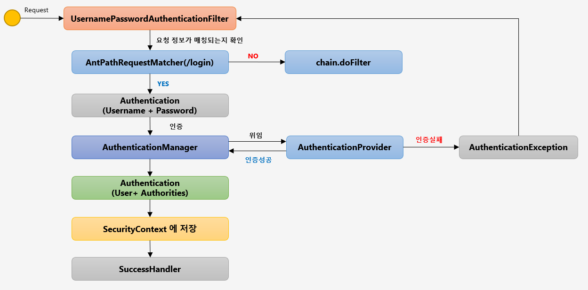

# 스프링 시큐리티 기본 API 및 Filter 이해

- - - 

## 프로젝트 구성 및 의존성 추가

~~~
<dependency>
      <groupId>org.springframework.boot</groupId>
      <artifactId>spring-boot-starter-security</artifactId>
    </dependency>
~~~

***스프링 시큐리티의 의존성 추가 시 일어나는 일들***

1. 서버가 기동되면 스프링 시큐리티의 초기화 작업 및 보안 설정이 이루어진다
2. 별도의 설정이나 구현을 하지 않아도 기본적인 웹 보안 기능이 현재 시스템에 연동되어 작동함

- 모든 요청은 인증이 되어야 자원에 접근이 가능하다
- 인증 방식은 폼 로그인 방식과 httpBasic 로그인 방식을 제공한다
- 기본 로그인 페이지를 제공한다
- 기본 계정을 한개 제공한다 - username : user / password : 랜덤 문자열

***문제점***

1. 계정 추가, 권한 추가, DB연동 등
2. 기본적인 보안 기능 외에 시스템에서 필요로 하는 더 세부적이고 추가적인 보안 기능이 필요

## 사용자 정의 보안 기능 구현

### SecurityConfig 설정

~~~
  @Configuration
  @EnableWebSecurity
  public class SecurityConfig extends WebSecurityConfigurerAdapter {

    @Override
    protected void configure(HttpSecurity http) throws Exception { 
      http
          .authorizeRequests()
          .anyRequest().authenticated()
          .and()
          .formLogin();
    }
~~~

#### WebSecurityConfigurerAdapter를 상속받은 SecurityConfig 클래스에서는 사용자가 직접 보안 설정을 정의 할 수 있다
### Form 인증

#### 클라이언트와 서버간의 관계속에서 스프링 시큐리티가 인증처리 프로세스
1. 사용자가 GET방식으로 /home 자원에 접근한다
2. 사용자가 인증을 받지 않은 경우 로그인 페이지로 리다이렉트 (실패)
3. POST 방식으로 인증을 시도 (성공)
4. 서버에서는 스프링 시큐리티가 세션을 생성하게 되고 그 세션에 Authorization 객체를 생성해서 저장한다 (SecurityContext에 저장한다)
5. 인증을 받은 이후 /home 자원에 접근을 시도하면 스프링 시큐리티는 사용자가 가진 세션으로부터 토큰의 존재여부를 판단 후 자원에 접근한다, 스프링 시큐리티는 세션에 저장된
   인증토큰이 있다면 사용자가 인증된 사용자라고 판단하고 인증을 유지한다

### Form Login 인증 API

~~~
protected void configure(HttpSecurity http) throws Exception {
         http
         formLogin()
         .loginPage(“/login.html") // 사용자 정의 로그인 페이지
         .defaultSuccessUrl("/home) // 로그인 성공 후 이동 페이지
         .failureUrl(＂/login.html?error=true“) // 로그인 실패 후 이동 페이지
         .usernameParameter("username") // 아이디 파라미터명 설정
         .passwordParameter(“password”) // 패스워드 파라미터명 설정
         .loginProcessingUrl(“/login") // 로그인 Form Action Url
         .successHandler(loginSuccessHandler()) // 로그인 성공 후 핸들러
         .failureHandler(loginFailureHandler()) // 로그인 실패 후 핸들러
}
~~~

## UsernamePasswordAuthenticationFilter

#### 인증처리를 담당하고 인증처리에 요청을 처리하는 필터가 UsernamePasswordAuthenticationFilter이다 내부적으로 각각의 인증처리의 역할을 통해 인증처리를 하게 된다
1. 사용자가 Request
2. 사용자의 요청정보를 UsernamePasswordAuthenticationFilter가 확인한다
3. AntPathRequestMatcher가 요청 정보가 매칭되는지 확인한다
4. 매칭이 되면 인증처리, 매칭이 되지 않으면 필터로 이동한다
5. Authentication 객체를 생성해서 사용자가 로그인 할 때 입력한 정보를 저장한다
6. AuthenticationManager (인증관리자) 가  필터로부터 인증 객체를 전달 받고 인증을 하게 된다
7. AuthenticationProvider에게 인증을 위임한다 (실질적으로 인증을 하는 클래스)
8. 인증이 실패하면 AuthenticationException (인증예외) 를 발생시켜 다시 필터가 받아 예외 후속작업을 실행
9. 인증이 성공하면 Authentication 객체를 생성해서 AuthenticationManager에게 리턴한다
10. AuthenticationManager는 전달받은 인증 객체를 다시 Filter 에게 리턴한다
11. Filter는 인증을 처리한 이후에 Authentication 객체를 전달받고 인증 객체를 SecurityContext에 저장한다(인증 객체 저장소, 전역으로 Authentication 객체를 참조 가능)
12. SuccessHandler에서 인증 성공 이후 작업를 진행

#### 크게 인증을 하기 전 작업 , 인증 후 작업으로 나뉘는데 그 분기점은 AuthenticationManager이다.

